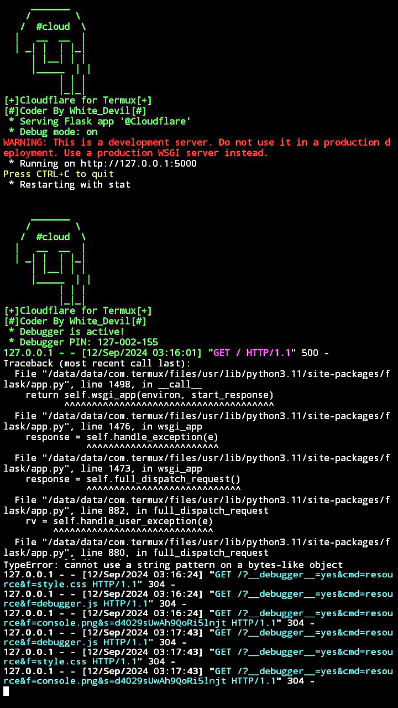

# Cloudflare Free Version 
<br>
- What is Cloudflare Free Version System  ?
> This is upload any files.
> Host any website or webserver.
> Host do not need any domains.
> this tool made by @whitedevil1097

<br>


- Cloudflare Free Version 

* `Upload Any Files just sec.`

* `Supports newest Android also.`

* `Get host any website or webserver.`

* `Working with all Operators/Carriers.`

* `No missing Api issues, all files will be upload in sequence.`

*  For Paid Version Contact Instagram : @whitedevil1097  

<br>

- Support

> `termux and all linux s.etc..`

> `before update works only india.`

> `Apis and more threads.`
> command in your terminal:
    ```python
>>> pip install -r requirements.txt.
>>>#for windows
>>> pip3 install -r requirements.txt
>>> #for macos and linux.
    ```
 <br>
 Author:White_Devil
  Channel:Hacker_Devill Subcribe 
<br>
<h3>Visitors :</h3>
<br>

